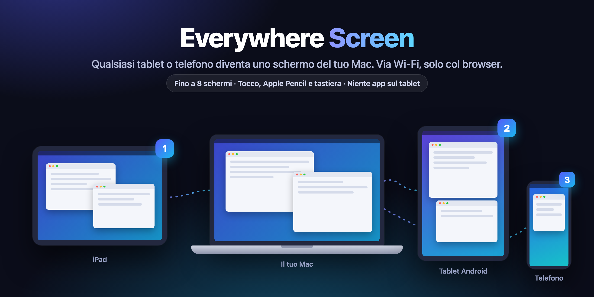
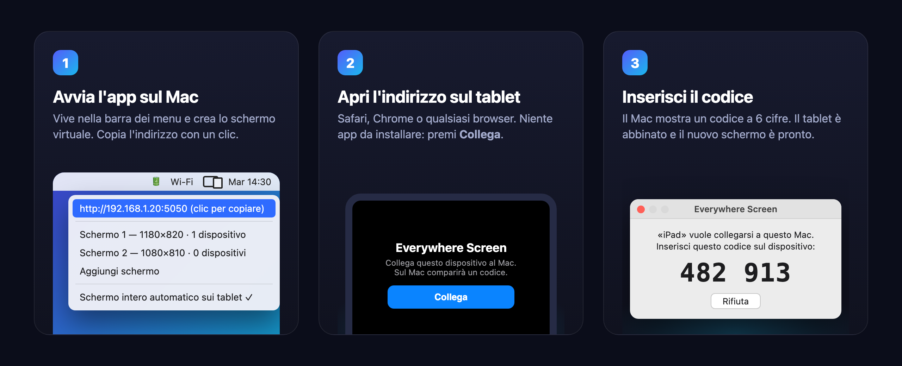

<p align="center">
  
</p>

<h1 align="center">Everywhere Screen</h1>

<p align="center"><a href="README.md">English</a> · <b>Italiano</b></p>

<p align="center">
  <b>Trasforma qualsiasi tablet o telefono in un secondo schermo per il tuo Mac.</b><br>
  iPad, Android, iPhone: via Wi‑Fi, senza installare nulla sul dispositivo. Basta il browser.<br>
  Gratis e open source.
</p>

<p align="center">
  <a href="https://github.com/massimopozzi1989-gif/Everywhere-Screen/releases/latest"></a>
  
  
  
  <a href="LICENSE"></a>
</p>

<p align="center">
  
</p>

---

## Perché Everywhere Screen

Hai un vecchio iPad nel cassetto, un tablet Android o un telefono che non usi? Diventano uno
**schermo esteso vero** del tuo Mac: ci trascini le finestre, ci tieni chat, note o la
timeline mentre lavori sullo schermo principale.

- 🖥️ **Schermi veri, non copie.** L'app crea fino a **8 schermi virtuali** che macOS vede come
  monitor collegati. Ognuno prende automaticamente la risoluzione e l'orientamento del tablet.
- 🌐 **Niente app sul tablet.** Si apre un indirizzo nel browser (Safari, Chrome…). Funziona anche
  con iPad e Android vecchi che Sidecar non supporta.
- ⚡ **Fluido.** Video H.264 accelerato in hardware, fino a 60 fps, con pochi millisecondi di
  elaborazione sul Mac. Se il Wi‑Fi rallenta si saltano fotogrammi invece di accumulare ritardo.
- ✍️ **Controlla il Mac dal tablet.** Tocco, doppio clic, trascinamento, clic destro, scroll a
  due dita, **Apple Pencil con pressione**, tastiera a schermo e tastiere fisiche con le
  scorciatoie (⌘C, ⌘V…). Puoi anche passare in modalità "solo schermo".
- 📱 **Schermo intero** con un tocco, senza le barre del browser.
- 🔒 **Abbinamento sicuro.** Ogni dispositivo si collega con un codice a 6 cifre mostrato sul Mac.
  Puoi revocarlo quando vuoi. Nessun servizio cloud: tutto resta sulla tua rete.
- 🌍 **Italiano e inglese.** L'app e la pagina del tablet parlano la tua lingua: si sceglie dal
  menu (Lingua · Language) o segue automaticamente il sistema e il browser.
- 🧭 **Disposizione semplice.** Editor visuale e disposizioni pronte (a destra, a sinistra, ai due
  lati, sopra, sotto) per decidere dove stanno i tablet rispetto al Mac.

## Come funziona

<p align="center">
  
</p>

1. **Scarica** il DMG dalla [pagina delle release](https://github.com/massimopozzi1989-gif/Everywhere-Screen/releases/latest),
   aprilo e trascina **Everywhere Screen** in Applicazioni. Oppure con [Homebrew](https://brew.sh):
   ```bash
   brew install --cask massimopozzi1989-gif/tap/everywhere-screen
   ```
2. **Avvia l'app.** Compare un'icona nella barra dei menu. Al primo avvio macOS chiede il permesso
   **Registrazione schermo** (serve per inviare l'immagine al tablet).
3. **Sul tablet**, connesso alla stessa rete Wi‑Fi del Mac, apri l'indirizzo mostrato nel menu
   (per esempio `http://192.168.1.20:5050`), premi **Collega** e inserisci il codice.
4. Fatto. Per usarlo come un'app, aggiungi la pagina alla **schermata Home** del tablet.

> Per controllare il Mac dal tablet serve anche il permesso **Accessibilità**: l'app te lo
> chiede la prima volta che tocchi lo schermo.

## Gesti

| Sul tablet | Sul Mac |
|---|---|
| tap | clic |
| doppio / triplo tap | doppio / triplo clic |
| trascinare | trascinamento (selezione, spostare finestre) |
| pressione lunga · tap a due dita | clic destro |
| scorrere con due dita | scroll |
| Apple Pencil | puntatore preciso con pressione |
| pulsante ⌨︎ | tastiera a schermo |
| pulsante ⛶ | schermo intero |

## Everywhere Screen e Sidecar

| | Everywhere Screen | Sidecar (Apple) |
|---|---|---|
| Tablet Android e telefoni | ✅ | ❌ |
| iPad vecchi | ✅ con un browser moderno | solo modelli recenti |
| Stesso Apple ID richiesto | ❌ | ✅ |
| App da installare sul dispositivo | nessuna | nessuna (solo iPad) |
| Schermi in contemporanea | fino a 8 | 1 |
| Apple Pencil | ✅ con pressione | ✅ |

## Requisiti

- **Mac** con Apple Silicon (M1 o successivo) e **macOS 14 Sonoma** o successivo.
- **Tablet o telefono** con un browser recente (Safari, Chrome). Sui browser più vecchi, senza
  Media Source Extensions, l'app passa da sola a un flusso MJPEG compatibile.
- Mac e dispositivo sulla **stessa rete Wi‑Fi**.

Con 8 schermi Retina collegati insieme si arriva a circa 30 fps per schermo (misurato su M1 Max).

## Domande frequenti

<details>
<summary><b>Il tablet non si collega</b></summary>

Controlla che Mac e tablet siano sulla stessa rete Wi‑Fi (non la rete "ospiti", che spesso isola
i dispositivi) e scrivi l'indirizzo con `http://` davanti. Se il Firewall di macOS è attivo,
consenti le connessioni in entrata per Everywhere Screen.
</details>

<details>
<summary><b>Lo schermo del tablet resta nero</b></summary>

Apri Impostazioni di Sistema → Privacy e sicurezza → **Registrazione schermo** e abilita
Everywhere Screen, poi riavvia l'app.
</details>

<details>
<summary><b>I tocchi non controllano il Mac</b></summary>

Serve il permesso **Accessibilità** (Impostazioni di Sistema → Privacy e sicurezza →
Accessibilità). Controlla anche che sul tablet il pulsante in basso dica "Controllo attivo" e,
nel menu dell'app, che il dispositivo abbia "Può controllare il Mac".
</details>

<details>
<summary><b>È sicuro?</b></summary>

Senza abbinamento nessuno vede il tuo schermo né può controllare il Mac. Ogni dispositivo riceve
un token personale, e sul Mac se ne conserva solo l'impronta. Dal menu puoi revocare un
dispositivo o togliergli il controllo. L'immagine viaggia solo sulla tua rete locale, in HTTP non
cifrato: usalo su reti di cui ti fidi.
</details>

<details>
<summary><b>Perché non è sul Mac App Store?</b></summary>

Per creare schermi virtuali l'app usa un'API di macOS che Apple non consente nello Store (la
stessa di BetterDisplay e DeskPad). L'app è comunque **firmata con Developer ID e notarizzata da
Apple**, quindi si apre senza avvisi.
</details>

<details>
<summary><b>Posso usarlo senza il Wi‑Fi?</b></summary>

Basta una rete locale comune: anche l'hotspot del telefono o un cavo Ethernet sul Mac vanno bene,
purché il tablet raggiunga l'indirizzo del Mac.
</details>

## Per sviluppatori

Il progetto non usa Xcode: `swiftc` compila `Sources/*.swift`.

```bash
./build.sh            # build/Everywhere Screen.app, firmata Developer ID
./build.sh install    # la installa in /Applications e la avvia
scripts/test.sh       # test della geometria delle disposizioni
scripts/stress.sh     # stress test di server, streaming e abbinamento (frame sintetici, ~90 s)
scripts/release.sh    # DMG firmato e notarizzato in dist/
scripts/update-cask.sh  # aggiorna il cask Homebrew alla nuova release
```

Architettura e decisioni: [docs/specs](docs/specs/2026-09-24-everywhere-screen-design.md).

## Contribuire

Segnalazioni, idee e pull request sono benvenute: apri una [issue](https://github.com/massimopozzi1989-gif/Everywhere-Screen/issues)
o una [discussione](https://github.com/massimopozzi1989-gif/Everywhere-Screen/discussions).
Prima di una pull request lancia `scripts/test.sh` e `scripts/stress.sh`.

## Licenza

Everywhere Screen è software libero, distribuito con la [GNU General Public License v3.0](LICENSE).
Puoi usarlo, studiarlo, condividerlo e modificarlo; le versioni che distribuisci devono restare
con la stessa licenza.

---

<p align="center">Fatto con ❤️ in Italia da Massimo Pozzi · Se ti è utile, lascia una ⭐</p>
