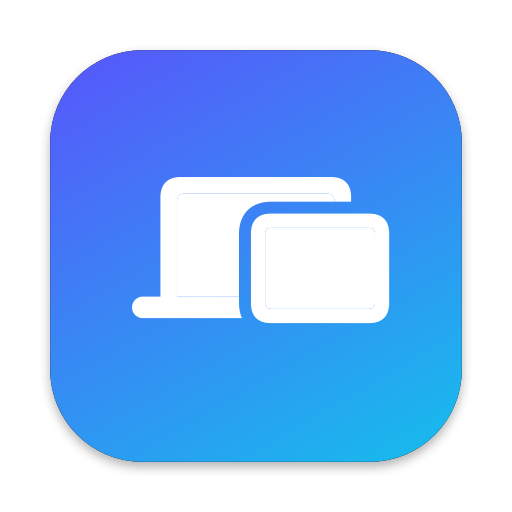
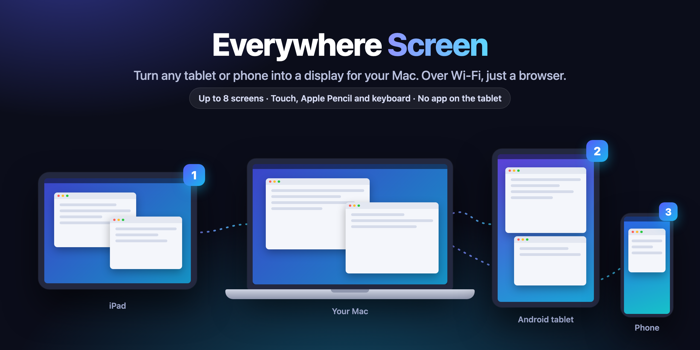
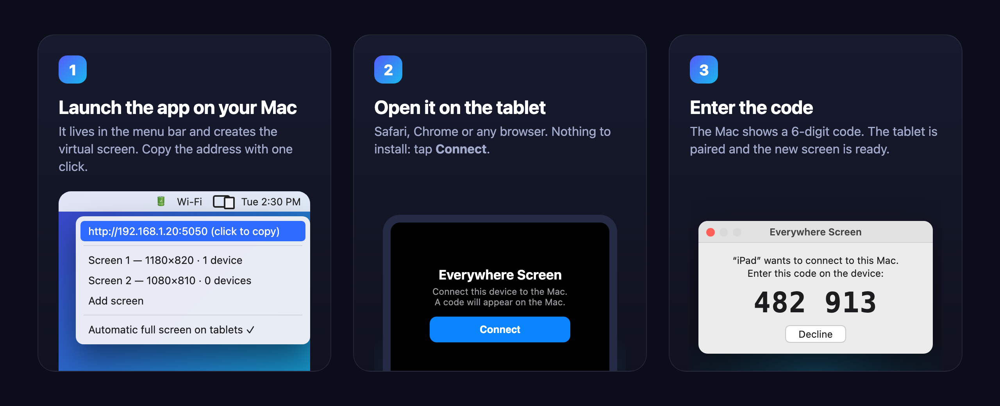

<p align="center">
  
</p>

<h1 align="center">Everywhere Screen</h1>

<p align="center"><b>English</b> · <a href="README.it.md">Italiano</a></p>

<p align="center">
  <b>Turn any tablet or phone into a second display for your Mac.</b><br>
  iPad, Android, iPhone: over Wi‑Fi, with nothing to install on the device. Just a browser.<br>
  Free and open source.
</p>

<p align="center">
  <a href="https://github.com/massimopozzi1989-gif/Everywhere-Screen/releases/latest"></a>
  
  
  
  <a href="LICENSE"></a>
</p>

<p align="center">
  
</p>

---

## Why Everywhere Screen

Got an old iPad in a drawer, an Android tablet or a spare phone? Make it a **real extended
display** for your Mac: drag windows onto it and keep your chat, notes or timeline there while
you work on the main screen.

- 🖥️ **Real displays, not mirrors.** The app creates up to **8 virtual displays** that macOS
  sees as connected monitors. Each one takes the resolution and orientation of its tablet.
- 🌐 **No app on the tablet.** Open an address in the browser (Safari, Chrome…). Works with older
  iPads and Android tablets that Sidecar doesn't support.
- ⚡ **Smooth.** Hardware‑accelerated H.264 video, up to 60 fps, with just a few milliseconds of
  processing on the Mac. When Wi‑Fi slows down it skips frames instead of building up lag.
- ✍️ **Control your Mac from the tablet.** Tap, double‑click, drag, right‑click, two‑finger
  scroll, **Apple Pencil with pressure**, on‑screen keyboard and hardware keyboards with
  shortcuts (⌘C, ⌘V…). Or switch to "screen only" mode.
- 📱 **Full screen** with one tap, without the browser bars.
- 🔒 **Secure pairing.** Each device connects with a 6‑digit code shown on the Mac and can be
  revoked at any time. No cloud service: everything stays on your network.
- 🌍 **English and Italian.** Pick the language from the menu (Lingua · Language), or let it
  follow your Mac and each tablet's browser.
- 🧭 **Easy arrangement.** A visual editor and ready‑made layouts (right, left, both sides,
  above, below) decide where the tablets sit around your Mac.

## How it works

<p align="center">
  
</p>

1. **Download** the DMG from the [releases page](https://github.com/massimopozzi1989-gif/Everywhere-Screen/releases/latest),
   open it and drag **Everywhere Screen** to Applications. Or use [Homebrew](https://brew.sh):
   ```bash
   brew install --cask massimopozzi1989-gif/tap/everywhere-screen
   ```
2. **Launch the app.** An icon appears in the menu bar. On first launch macOS asks for the
   **Screen Recording** permission (needed to send the picture to the tablet).
3. **On the tablet**, on the same Wi‑Fi network as the Mac, open the address shown in the menu
   (for example `http://192.168.1.20:5050`), tap **Connect** and enter the code.
4. Done. To use it like an app, add the page to the tablet's **Home Screen**.

> To control the Mac from the tablet, the app also needs the **Accessibility** permission:
> it asks the first time you touch the screen.

## Gestures

| On the tablet | On the Mac |
|---|---|
| tap | click |
| double / triple tap | double / triple click |
| drag | drag (select, move windows) |
| long press · two‑finger tap | right‑click |
| two‑finger swipe | scroll |
| Apple Pencil | precise pointer with pressure |
| ⌨︎ button | on‑screen keyboard |
| ⛶ button | full screen |

## Everywhere Screen vs. Sidecar

| | Everywhere Screen | Sidecar (Apple) |
|---|---|---|
| Android tablets and phones | ✅ | ❌ |
| Older iPads | ✅ with a modern browser | recent models only |
| Same Apple ID required | ❌ | ✅ |
| App to install on the device | none | none (iPad only) |
| Simultaneous displays | up to 8 | 1 |
| Apple Pencil | ✅ with pressure | ✅ |

## Requirements

- A **Mac** with Apple Silicon (M1 or later) and **macOS 14 Sonoma** or later.
- A **tablet or phone** with a recent browser (Safari, Chrome). On older browsers without Media
  Source Extensions, the app automatically switches to a compatible MJPEG stream.
- Mac and device on the **same Wi‑Fi network**.

With 8 Retina displays connected at once you get about 30 fps per display (measured on an M1 Max).

## FAQ

<details>
<summary><b>The tablet won't connect</b></summary>

Make sure the Mac and the tablet are on the same Wi‑Fi network (not a "guest" network, which
often isolates devices) and type the address with `http://` in front. If the macOS Firewall is
on, allow incoming connections for Everywhere Screen.
</details>

<details>
<summary><b>The tablet screen stays black</b></summary>

Open System Settings → Privacy & Security → **Screen Recording**, enable Everywhere Screen and
restart the app.
</details>

<details>
<summary><b>Touches don't control the Mac</b></summary>

The app needs the **Accessibility** permission (System Settings → Privacy & Security →
Accessibility). Also check that the button at the bottom of the tablet says "Control on" and
that, in the app menu, the device has "Can control the Mac" enabled.
</details>

<details>
<summary><b>Is it safe?</b></summary>

Without pairing, nobody can see your screen or control your Mac. Each device gets a personal
token, and the Mac only stores its fingerprint. From the menu you can revoke a device or take
away its control. The picture only travels over your local network, as unencrypted HTTP: use it
on networks you trust.
</details>

<details>
<summary><b>Why isn't it on the Mac App Store?</b></summary>

To create virtual displays the app uses a macOS API that Apple doesn't allow in the Store (the
same one BetterDisplay and DeskPad use). The app is still **signed with a Developer ID and
notarized by Apple**, so it opens without warnings.
</details>

<details>
<summary><b>Can I use it without Wi‑Fi?</b></summary>

Any shared local network works: your phone's hotspot or an Ethernet cable on the Mac are fine,
as long as the tablet can reach the Mac's address.
</details>

## For developers

The project doesn't use Xcode: `swiftc` compiles `Sources/*.swift`.

```bash
./build.sh            # build/Everywhere Screen.app, signed with Developer ID
./build.sh install    # installs it in /Applications and launches it
scripts/test.sh       # layout geometry tests
scripts/stress.sh     # stress tests for server, streaming and pairing (synthetic frames, ~90 s)
scripts/release.sh    # signed and notarized DMG in dist/
scripts/update-cask.sh  # points the Homebrew cask to the new release
```

Architecture and design decisions (in Italian): [docs/specs](docs/specs/2026-09-24-everywhere-screen-design.md).

## Contributing

Bug reports, ideas and pull requests are welcome: open an [issue](https://github.com/massimopozzi1989-gif/Everywhere-Screen/issues)
or start a [discussion](https://github.com/massimopozzi1989-gif/Everywhere-Screen/discussions).
Before a pull request, run `scripts/test.sh` and `scripts/stress.sh`.

## License

Everywhere Screen is free software, released under the [GNU General Public License v3.0](LICENSE).
You can use, study, share and modify it; versions you distribute must stay under the same license.

---

<p align="center">Made with ❤️ in Italy by Massimo Pozzi · If you find it useful, leave a ⭐</p>
